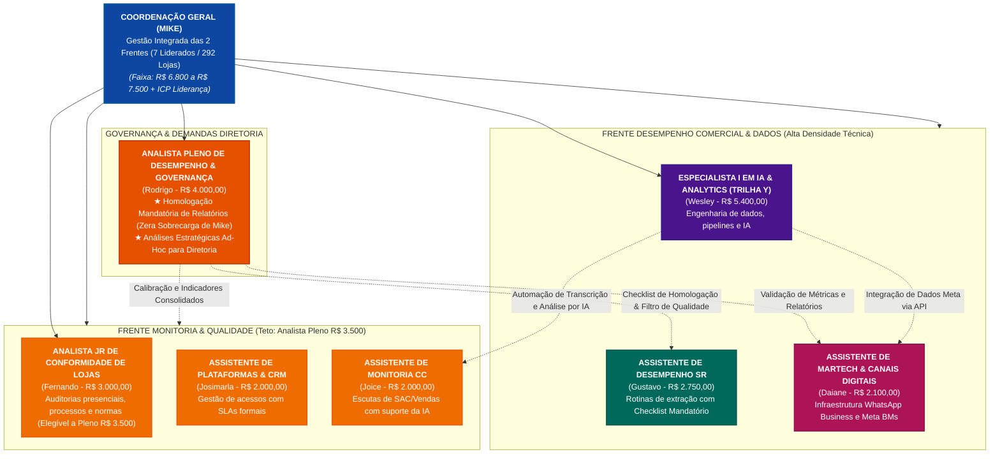

# PARECER CONSULTIVO E PLANO ESTRUTURAL DE CARGOS, CARREIRA E REMUNERAÇÃO
## Setor de Desempenho Comercial & Analytics (Integrado à Monitoria e Qualidade)

**Data de Revisão:** 25 de Setembro de 2026  
**Versão:** 3.4 — Arquitetura de Monitoria Enxuta (Teto em Analista Pleno a R$ 3.500,00)  
**Especialidade:** Consultor Sênior de Design Organizacional, Cargos, Salários e Total Rewards  
**Status:** Estrutura Consolidada e Pronta para Defesa Executiva  
**Público-Alvo:** Coordenação do Setor, Gerência de RH, Diretoria Comercial e Diretoria de Operações  

---

## 1. Sumário Executivo & Decisão de Enxugamento da Monitoria

Esta versão consolida uma decisão altamente estratégica de **Design Organizacional e Contenção Orçamentária**:

1. **Extinção do Nível Sênior na Frente de Monitoria:**  
   Reconhece-se que as rotinas de escutas operacionais, calibração de atendimento de SAC/vendas e auditoria visual de lojas possuem um limite natural de complexidade técnica que não justifica a existência de uma cadeira de **Analista Sênior**. A carreira técnica da Monitoria encerra-se formalmente no nível **Analista Pleno**.
2. **Fixação do Teto da Monitoria em R$ 3.500,00:**  
   O cargo de Analista Pleno de Monitoria é delimitado exatamente em **R$ 3.500,00** (+16,7% sobre o Analista Jr de R$ 3.000,00), restaurando a coerência com a tabela histórica da Facta e blindando a folha de pagamento contra inflação desnecessária.
3. **Mecanismo de Transição de Carreira (Ponte Monitoria $\rightarrow$ Desempenho):**  
   Cria-se um poderoso direcionador de desenvolvimento interno: o colaborador de Monitoria que atingir o teto de Analista Pleno (R$ 3.500,00) e desejar ascensão salarial adicional é incentivado a migrar para a frente de **Desempenho Comercial & Analytics**, desenvolvendo competências em SQL, Power BI, DAX e modelagem dimensional, onde existem as cadeiras de Analista Sênior (R$ 4.800) e Especialista I (R$ 5.400).
4. **Harmonização do Quadro Nominal:**  
   * **Fernando (Monitoria):** Analista Jr em R$ 3.000,00 (com horizonte claro de promoção para Pleno em R$ 3.500,00).
   * **Gustavo (Desempenho):** Assistente Sr em R$ 2.750,00 (encaixe exato).
   * **Rodrigo (Desempenho & Governança):** Analista Pleno em R$ 4.000,00 (encaixe exato na esteira de dados).
   * **Wesley (Desempenho):** Rota direta para Especialista I em R$ 5.400,00.
   * **Mike (Coordenação Geral):** Liderança estratégica integrada em R$ 6.800 a R$ 7.500.

---

## 2. Grade Salarial Comparativa Definitiva

```
┌─────────────────────────────────────────────────────────────────────────────────────────────┐
│                          TABELA SALARIAL CALIBRADA POR COMPLEXIDADE                         │
├─────────────────────┬───────────────────┬──────────────────────┬─────────────┬──────────────┤
│ NÍVEL HIERÁRQUICO   │ MONITORIA & QUAL. │ DESEMPENHO & DADOS   │ DIFERENÇA   │ VARIAÇÃO %   │
├─────────────────────┼───────────────────┼──────────────────────┼─────────────┼──────────────┤
│ Assistente Jr       │   R$ 2.000,00     │     R$ 2.100,00      │ + R$ 100,00 │   + 5,0%     │
│ Assistente Pleno    │   R$ 2.300,00     │     R$ 2.450,00      │ + R$ 150,00 │   + 6,5%     │
│ Assistente Sênior   │   R$ 2.600,00     │     R$ 2.750,00      │ + R$ 150,00 │   + 5,8%     │
├─────────────────────┼───────────────────┼──────────────────────┼─────────────┼──────────────┤
│ Analista Júnior     │   R$ 3.000,00     │     R$ 3.200,00      │ + R$ 200,00 │   + 6,7%     │
│ Analista Pleno      │   R$ 3.500,00     │     R$ 4.000,00      │ + R$ 500,00 │   + 14,3%    │
│                     │ *(TETO MÁXIMO)*   │                      │             │              │
├─────────────────────┼───────────────────┼──────────────────────┼─────────────┼──────────────┤
│ Analista Sênior     │   [NÃO APLICÁVEL] │     R$ 4.800,00      │ Exclusivo Trilha Desempenho │
│ Especialista I (Y)  │        —          │     R$ 5.400,00      │ Exclusivo Trilha Analytics   │
│ Coordenação Geral   │        —          │ R$ 6.800 a R$ 7.500  │ Gestão Integrada de Ambas    │
└─────────────────────┴───────────────────┴──────────────────────┴─────────────┴──────────────┘
```

### Análise das Escadas de Carreira:
* **Esteira de Monitoria & Qualidade:**  
  $\text{Assist. Jr (R\$ 2.000)} \xrightarrow{+15,0\%} \text{Assist. Pl (R\$ 2.300)} \xrightarrow{+13,0\%} \text{Assist. Sr (R\$ 2.600)} \xrightarrow{+15,4\%} \text{Analista Jr (R\$ 3.000)} \xrightarrow{+16,7\%} \mathbf{\text{Analista Pl (R\$ 3.500)}}$  
  *(Teto técnico atingido. Próxima evolução exige transição técnica para Desempenho ou gestão).*
* **Esteira de Desempenho & Analytics:**  
  $\text{Assist. Jr (R\$ 2.100)} \xrightarrow{+16,7\%} \text{Assist. Pl (R\$ 2.450)} \xrightarrow{+12,2\%} \text{Assist. Sr (R\$ 2.750)} \xrightarrow{+16,4\%} \text{Analista Jr (R\$ 3.200)} \xrightarrow{+25,0\%} \text{Analista Pl (R\$ 4.000)} \xrightarrow{+20,0\%} \text{Analista Sr (R\$ 4.800)} \xrightarrow{+12,5\%} \mathbf{\text{Especialista I (R\$ 5.400)}}$.

---

## 3. Organograma Integrado do Setor



---

## 4. Engenharia de Remuneração Variável (ICP Balanceado)

```
┌─────────────────────────────────────────────────────────────────────────────┐
│                 COMPOSIÇÃO BALANCEADA DA REMUNERAÇÃO VARIÁVEL               │
├─────────────────────┬─────────┬─────────────────────────────────────────────┤
│ COMPONENTE          │ PESO    │ INDICADORES AVALIADOS                       │
├─────────────────────┼─────────┼─────────────────────────────────────────────┤
│ 1. Resultado Rede   │   30%   │ % Atingimento da Meta de Vendas da Rede     │
│ 2. Eficiência Área  │   50%   │ SLA de Dashboards, Acurácia (Zero Erros) e  │
│                     │         │ Cobertura de Auditorias/Conformidade        │
│ 3. PDI & Inovação   │   20%   │ Conclusão de Projetos Estratégicos (ex: IA, │
│                     │         │ APIs de WhatsApp, melhorias metodológicas)  │
└─────────────────────┴─────────┴─────────────────────────────────────────────┤
│ *GATILHO DE SEGURANÇA (HARD GATE):* Se a Acurácia de Dados do mês for menor│
│ que 95% (erros em relatórios enviados à diretoria), o Vetor Setorial é ZERO │
└─────────────────────────────────────────────────────────────────────────────┘
```

### Grade de Metas e Valores-Alvo Mensais

| Cargo / Colaborador | Frente Funcional | Target Mensal (100% Meta) | Teto Máximo (>= 110%) | Indicadores-Chave Específicos |
| :--- | :--- | :--- | :--- | :--- |
| **Coordenador Geral (Mike)** | Gestão Geral | R$ 2.500,00 a R$ 3.000,00 | R$ 4.000,00 | Vendas da Rede (40%), SLA e Acurácia Setorial (30%), Projetos Estratégicos (30%) |
| **Analista Pleno Governança (Rodrigo)** | Desempenho | R$ 1.200,00 a R$ 1.500,00 | R$ 2.000,00 | Zero Erros em Relatórios Homologados (40%), SLA Diretoria (30%), Vendas Rede (30%) |
| **Especialista I IA & Analytics (Wesley)**| Desempenho | R$ 1.200,00 a R$ 1.500,00 | R$ 2.000,00 | Entregas de IA/Pipelines (40%), SLA de Bancos de Dados (30%), Vendas Rede (30%) |
| **Analista Jr Conformidade (Fernando)** | Monitoria | R$ 650,00 | R$ 900,00 | Cobertura de Auditorias em Lojas (40%), Aderência de Processos (30%), Vendas Rede (30%) |
| **Assistente Sr Desempenho (Gustavo)** | Desempenho | R$ 450,00 | R$ 650,00 | Cumprimento de Checklist de Validação (50%), SLA Relatórios (30%), Vendas Rede (20%) |
| **Assistente MarTech / Meta (Daiane)** | Desempenho | R$ 450,00 | R$ 650,00 | Disponibilidade Linhas/BMs (50%), SLA de Atendimento (30%), Vendas Rede (20%) |
| **Assistente de CRM / Lojas (Josimarla)** | Monitoria | R$ 400,00 | R$ 600,00 | SLA de Criação/Bloqueio de Logins (50%), Volume de Demandas (30%), Vendas Rede (20%) |
| **Assistente de Escutas SAC (Joice)** | Monitoria | R$ 400,00 | R$ 600,00 | Aderência Amostral de Escutas (50%), SLA Retornos (30%), Vendas Rede (20%) |

---

## 5. Protocolo Mandatório de Validação de Dados (5 Etapas)

```
┌─────────────────────────────────────────────────────────────────────────────┐
│              FLUXO OPERACIONAL MANDATÓRIO DE HOMOLOGAÇÃO DE DADOS            │
├───────┬──────────────────────┬──────────────────────────────────────────────┤
│ ETAPA │ PROCEDIMENTO         │ RESPONSÁVEL & EXECUÇÃO                       │
├───────┼──────────────────────┼──────────────────────────────────────────────┤
│ 1     │ Checksum de Linhas   │ Gustavo: Conferência de somas brutas x bases │
│ 2     │ Checagem de Filtros  │ Gustavo: Validação de filtros de data/loja   │
│ 3     │ Conciliação de Rede  │ Gustavo: Verificação das 292 lojas ativas    │
│ 4     │ Assinatura Checklist │ Gustavo: Registro digital do formulário POP │
│ 5     │ Homologação & Envio  │ Rodrigo: Crivo técnico e liberação oficial   │
└───────┴──────────────────────┴──────────────────────────────────────────────┘
```

---

## 6. Quadro Nominal Definitivo de Enquadramento da Equipe

| Colaborador | Frente | Cargo Atual | Salário Atual | Novo Cargo Oficial | Salário de Tabela | Diagnóstico de Ajuste |
| :--- | :--- | :--- | :---: | :--- | :---: | :--- |
| **Mike** | Gestão | Coordenador | R$ 5.000,00 | Coordenador Geral de Desempenho & Qualidade | **R$ 6.800 a R$ 7.500** | Reajuste e emancipação gerencial plena |
| **Rodrigo** | Desempenho | Analista Pl | R$ 4.000,00 | Analista Pleno de Desempenho & Governança | **R$ 4.000,00** | **Encaixe 100% Exato** na esteira de dados |
| **Wesley** | Desempenho | Analista Jr | R$ 3.000,00 | Especialista I em IA & Analytics (Trilha Y) | **R$ 5.400,00** | Salto de retenção para Carreira em Y |
| **Gustavo** | Desempenho | Assistente Sr| R$ 2.750,00 | Assistente de Desempenho Comercial Sr | **R$ 2.750,00** | **Encaixe 100% Exato** na tabela de Assistente Sr |
| **Daiane** | Desempenho | Assistente Jr| R$ 2.000,00 | Assistente de Operações Digitais & MarTech | **R$ 2.100,00** | Pequeno ajuste de entrada de Desempenho (+R$ 100) |
| **Fernando** | Monitoria | Analista Jr | R$ 3.000,00 | Analista Jr de Conformidade de Lojas | **R$ 3.000,00** | **Encaixe 100% Exato**; horizonte de Pleno até R$ 3.500 |
| **Josimarla** | Monitoria | Assistente Jr| R$ 2.000,00 | Assistente de Plataformas & CRM | **R$ 2.000,00** | **Encaixe 100% Exato** na tabela de Assistente Jr |
| **Joice** | Monitoria | Assistente Jr| R$ 2.000,00 | Assistente de Monitoria de Qualidade | **R$ 2.000,00** | **Encaixe 100% Exato** na tabela de Assistente Jr |

---

## 7. Verificação de Aderência Real e Segurança Jurídica

1. **A Monitoria ficou protegida contra custos excessivos?**  
   * **Sim.** O encerramento no nível Analista Pleno (R$ 3.500,00) garante previsibilidade orçamentária para uma área de auditoria de processos.
2. **Existe caminho de crescimento para Fernando na Monitoria?**  
   * **Sim.** Como Analista Júnior (R$ 3.000,00), Fernando tem como próximo passo de mérito o nível de Analista Pleno (R$ 3.500,00), o que representa um aumento de +16,7% condicionado ao PDI de relatórios objetivos no Power BI e comunicação construtiva com as lojas.
3. **A diferenciação técnica entre frentes continua juridicamente segura?**  
   * **Sim.** As atribuições de Desempenho (modelagem de dados, arquitetura e inteligência ad-hoc para diretoria) justificam os salários de Analista Pleno (R$ 4.000), Sênior (R$ 4.800) e Especialista (R$ 5.400), afastando riscos de equiparação salarial pelo Art. 461 da CLT.
